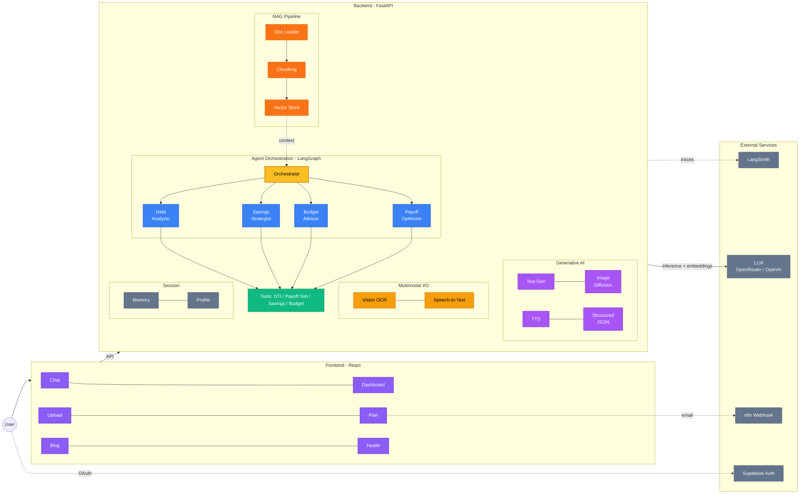

# Wealthify - AI Financial Coach: Architecture

```mermaid
graph LR
    U((User)) --> FE

    subgraph FE["Frontend - React"]
        direction TB
        C[Chat] --- D[Dashboard]
        UP[Upload] --- PL[Plan]
        BL[Blog] --- HE[Health]
    end

    FE -->|API| BE

    subgraph BE["Backend - FastAPI"]
        direction TB

        subgraph ORCH["Agent Orchestration - LangGraph"]
            direction LR
            O[Orchestrator] --> DA[Debt<br/>Analyzer]
            O --> SS[Savings<br/>Strategist]
            O --> BA[Budget<br/>Advisor]
            O --> PO[Payoff<br/>Optimizer]
        end

        subgraph RAG["RAG Pipeline"]
            direction LR
            L[Doc Loader] --> CH[Chunking] --> VS[Vector Store]
        end

        subgraph GEN["Generative AI"]
            direction LR
            TG[Text Gen] --- ID[Image<br/>Diffusion]
            TTS[TTS] --- JS[Structured<br/>JSON]
        end

        subgraph MIO["Multimodal I/O"]
            direction LR
            VIS[Vision OCR] --- STT[Speech-to-Text]
        end

        subgraph SESS["Session"]
            direction LR
            MEM[Memory] --- PROF[Profile]
        end

        T[Tools: DTI / Payoff Sim / Savings / Budget]

        VS -.->|context| O
        DA & SS & BA & PO --> T
    end

    subgraph EXT["External Services"]
        direction TB
        LLM[LLM<br/>OpenRouter / OpenAI]
        AUTH[Supabase Auth]
        LS[LangSmith]
        N8N[n8n Webhook]
    end

    BE -->|inference + embeddings| LLM
    BE -.->|traces| LS
    U -.->|OAuth| AUTH
    PL -.->|email| N8N

    classDef showcase fill:#fbbf24,stroke:#d97706,stroke-width:2px,color:#000
    classDef agent fill:#3b82f6,stroke:#1d4ed8,color:#fff
    classDef tool fill:#10b981,stroke:#059669,color:#fff
    classDef fe fill:#8b5cf6,stroke:#6d28d9,color:#fff
    classDef rag fill:#f97316,stroke:#ea580c,color:#fff
    classDef gen fill:#a855f7,stroke:#7e22ce,color:#fff
    classDef ext fill:#64748b,stroke:#475569,color:#fff
    classDef multi fill:#f59e0b,stroke:#d97706,color:#000

    class O showcase
    class DA,SS,BA,PO agent
    class T tool
    class C,D,UP,PL,BL,HE fe
    class L,CH,VS rag
    class TG,ID,TTS,JS gen
    class VIS,STT multi
    class LLM,AUTH,LS,N8N ext
    class MEM,PROF ext
```
