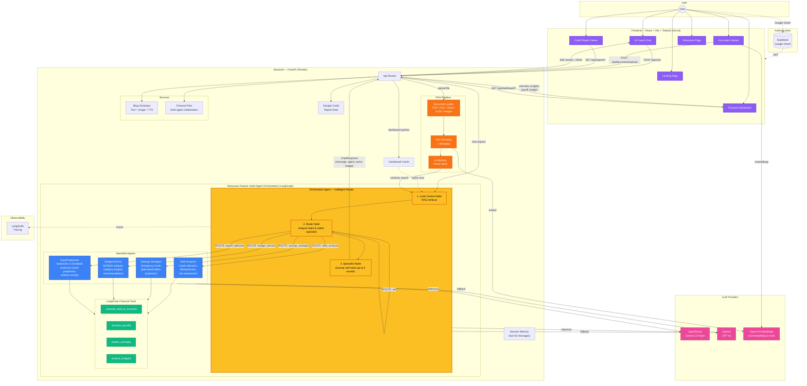

# DemoAI - AI Financial Coach: Architecture & Showcase Flow

## Flow Summary

### Showcase Feature: Multi-Agent Orchestration

The core showcase is the **LangGraph State Machine** that powers intelligent financial coaching:

1. **User sends a message** via the Chat interface
2. **Load Context Node** — RAG retrieves relevant document chunks from the user's uploaded financial data
3. **Route Node** — The Orchestrator LLM analyzes user intent and decides:
   - `self` — answer directly (simple/general queries)
   - `debt_analyzer` — debt, credit score, utilization questions
   - `savings_strategist` — savings goals, emergency funds
   - `budget_advisor` — spending analysis, budget planning
   - `payoff_optimizer` — debt payoff strategies, interest optimization
4. **Specialist Node** — The selected agent executes with access to **4 financial tools**, looping up to 5 rounds of tool calls for complex calculations
5. **Response** streams back via SSE with the agent's badge color indicating which specialist answered

### Supporting Flows

| Flow | Path |
|------|------|
| **Document Upload** | User → Upload Page → `/api/documents/upload` → Loader → Chunker → Vector Store (embeddings via OpenAI) |
| **Dashboard** | Dashboard Page → 4 parallel API calls → Cache check → RAG + LLM extraction → Financial tools → Rendered cards |
| **Credit Report** | Report Page → `/api/reports` → Sample JSON data → Rendered tables |
| **Blog Generation** | Admin Page → LLM text generation → Vision model image → gTTS audio |
